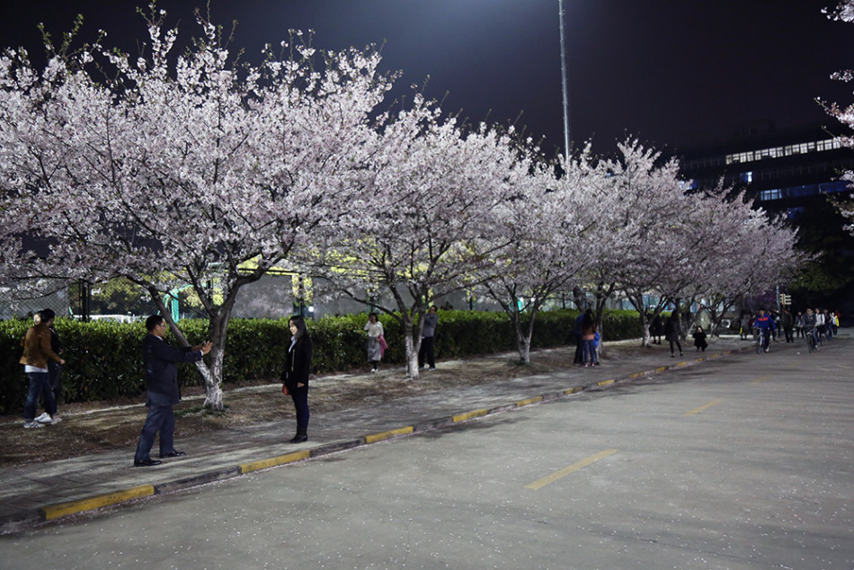
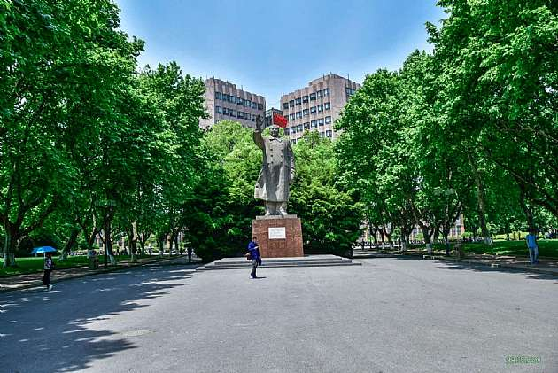
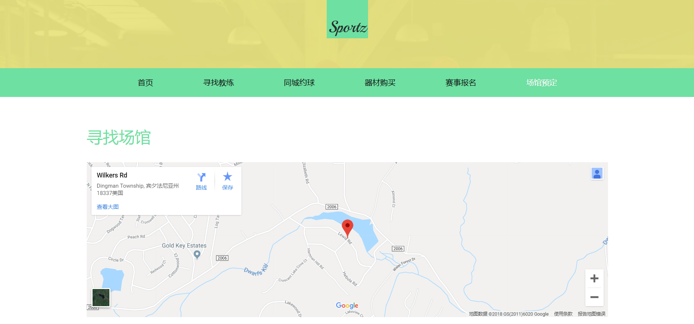

## 1  页面控制
### 1.1页面效果截屏


### 1.2源代码
```html
<!DOCTYPE html>
<html lang="en"><head><meta http-equiv="Content-Type" content="text/html; charset=UTF-8">
<title>first task</title>
</head>
<body align="center" background="./静态网页_files/lblue002.png">
<h1>同济大学</h1>
<ul align="left">
	<li><a href="./静态网页.html#tongji">同济大学简介</a></li>
	<li><a href="./静态网页.html#meili">美丽同济</a></li>
	<li><a href="./静态网页.html#huoshi">同济伙食</a></li>
</ul>

<article>
<h1><a id="tongji">同济大学简介</a></h1>
<h2>同济大学概览</h2>
<address style="display:inline">wikipedia</address> 
<time style="display:inline">2018</time>
<p align="left"><a href="https://baike.baidu.com/item/%E5%90%8C%E6%B5%8E%E5%A4%A7%E5%AD%A6">同济大学</a>（英语：Tongji University，德语：Tongji-Universität），简称“同济”，是历史悠久、享有盛誉的中国著名高等学府。同济大学是位于中国上海市的综合性大学，是中华人民共和国教育部直属的全国重点大学，行政级别为副部级，是“双一流”(A类)、“211工程”、“985工程”重点建设高校，
	是全球环境与可持续发展合作联盟、国际设计艺术院校联盟、21世纪学术联盟、卓越大学联盟、国际绿色校园联盟、同济-伯克利工程联盟、中俄工科大学联盟成员。</p>


<p align="left">同济大学目前共设有38个学院（系）和二级办学机构，7家附属医院，5所附属中学；有全日制本科生1.7万余人，硕士研究生1.3万余人，博士研究生近5000人。有外国留学生数千人；学校占地面积约3850亩；纸本图书400余万册。</p>

<p align="left">根据2018年QS世界大学排名和2018年泰晤士高等教育世界大学排名，同济大学均位列全国(中国大陆)第十。</p>
</article>
<br>
<br>

<div id="menu" style="width:1000px;float:left;">

</div>
		
<div id="content" style="float:left;">

</div>


<article>
<h1><a id="meili">美丽同济</a></h1>

<address style="display:inline">白皓月</address> 
<time style="display:inline">2018</time>
<p>&nbsp;&nbsp;&nbsp;&nbsp;每到春天，<br>

同济大学校本部的樱花<br>

渐渐变成了醉人的粉色，<br>

漫天飞舞的樱花随风飘落，<br>

“染”得一地浪漫。</p>


<br>
<br>

<h2>同济美景图</h2>
<p>毛像</p>

<br>
<br>
<p>国立柱</p>

<br>
<br>
<p>综合楼</p>

</article>
<br>
<br>


<article>
<h1><a id="huoshi">同济伙食</a></h1>
<h2 align="left">同济本部食堂排名</h2>
<ol align="left">
	<li>北苑食堂</li>
	<li>留学生食堂</li>
	<li>学苑食堂</li>
	<li>西苑食堂</li>
	<li>南苑食堂</li>
</ol>
<table border="1" align="center">
<tbody><tr>
<th>时间</th>
<th>食物</th>
<th>价格</th>
</tr>	
<tr><td>早餐</td>
<td>米线</td>
<td>2.2</td></tr>
<tr>
<td>中餐</td>	
<td>米饭</td>
<td>0.6</td>
</tr>
<tr>
<td>中餐</td>
<td>炒洋芋</td>
<td>0.8</td>
</tr>
<tr>
<td>中餐</td>
<td>梅菜扣肉</td>
<td>2.7</td>
</tr>
<tr>
<td>中餐</td>
<td>南瓜汤</td>
<td>1.5</td>
</tr>
<tr>
<td>晚餐</td>
<td>米饭</td>
<td>0.3</td>
</tr>
<tr>
<td>晚餐</td>
<td>煎蛋</td>
<td>2.0</td>
</tr>
<tr>
<td>晚餐</td>
<td>白菜</td>
<td>0.8</td>
</tr>
<tr>
<td>总计</td>
<td colspan="2">11.9</td>
</tr>
</tbody></table>
</article>
<br>
</body></html>
```

## 2  CSS布局
### 2.1页面效果截屏


### 2.2源代码
#### html代码
```html
<!DOCTYPE html>
<html lang="en"><head><meta http-equiv="Content-Type" content="text/html; charset=UTF-8">
	
	<title>css布局</title>
	<link rel="stylesheet" href="./css网页_files/06.css">
</head>
<body>
	<div class="container">
	    <header class="clearfix">
	     	<span>2018.12</span>
	        <a href="https://baike.baidu.com/item/%E4%B8%AD%E5%9B%BD%E5%9B%BD%E5%AE%B6%E4%B9%92%E4%B9%93%E7%90%83%E9%98%9F/806898?fromtitle=%E4%B8%AD%E5%9B%BD%E4%B9%92%E4%B9%93%E7%90%83%E9%98%9F&amp;fromid=8692693">国家队</a>
	    </header>
	    <main>
	        <div class="first clearfix">
	        	<div class="technologe fr">
	        		<strong>about</strong><br>
	        		<strong>table tennis</strong>
	        		<p>table tennis is a kind of intersting sport,which is great</p>
	        		<span class="big">ITTF</span>
	        		<div class="small">
	        			pin
	        			<span>gpong</span> <i>pppppp</i>
	        		</div>
	        	</div>
	        	<div class="img fl">
	        		<div class="green"></div>
	        		
	        	</div>
	        </div>
	        <div class="second">
	        	<ul>
	        		<li class="what">
	        			<h3>马龙</h3>
	        			<p>中国男子乒乓球员，辽宁人。首位集奥运会、世锦赛、世界杯、亚运会、亚锦赛、亚洲杯、巡回赛总决赛、全运会单打冠军于一身的超级全满贯男子选手。至2017年12月，马龙连续34个月、累计64个月排名世界第一。
	        			 </p>
	        		</li>
	        		<li class="when">
	        			<h3>张继科</h3>
	        			<p>中国乒乓球国手，山东青岛人。与瓦尔德内尔、刘国梁、孔令辉、马龙并列为五位大满贯男选手，十位大满贯男女选手之中以最短时间（445天）完成。赢得一枚奥运会单打金牌（2012），连续两届世乒赛单打冠军（2011、2013）和两个世界杯单打冠军（2011、2014）。
	        			</p>
	        		</li>
	        		<li class="how">
	        			<h3>丁宁</h3>
	        			<p>现任中国女子乒乓球队队长，中国女子乒乓球运动员，中国第五位实现乒乓球“大满贯”的女子运动员，生涯取得20个世界冠军头衔，仅次于取得24个世界冠军头衔的王楠。</p>
	        		</li>
	        	</ul>
	        </div>
	        
	    </main>
	    <footer>
	        辉煌与荣耀
	    </footer>
	</div>


</body></html>
```
#### css代码

```css
/*基本样式重置*/
*{
	margin: 0;
	padding:0;
	-moz-box-sizing:border-box; 
	-webkit-box-sizing:border-box;
	box-sizing:border-box;
}
ul {
    list-style: none;
    padding: 0;
    margin: 0;
}
a {
    text-decoration: none;
}
.fl{
	float: left;
}
.fr{
	float: right;
}
.clearfix:before, .clearfix:after {
  content: "";
  display: table;
}
.clearfix:after {
  clear: both;
}
.clearfix {
  *zoom: 1;
}


body{
	background: #5D5D5D;

}
.container{
	width: 980px;
	margin: 0 auto;
	padding:0 40px; 
	font-family: "微软雅黑";
	background: #FFFFFF;
}


/*首尾部样式*/
header{
	width: 892px;
	height: 63px;
	border-bottom: 2px solid #938e8c;
}
header a, header span{
	display: block;	
	font-size: 12px;
	font-family: "黑体";	
	padding-top: 43px;
}
header a{
	width: 110px;
	height: 61px;
	background: #D55D5C;
	color:#fff;
	text-indent: 5px;
}
header span{
	color: #d45d5c;
	height: 61px;
	float: right;
}
footer{
	width: 892px;
	height: 63px;
	border-top: 1px solid #938e8c;
	text-align: right;
	color: #d45d5c;
	font-size:12px;
	font-family: "黑体";
}


/*上半部分样式*/
.first{
	margin: 40px 0;
}
.img{
	width: 641px;
	height: 301px;
	position: relative;
	overflow: hidden;
}
.green, .red{
	width: 191px;
	height: 301px;
	opacity: 0.5;
	filter: Alpha(opacity=50);
	position: absolute;
}
.green{
	background: #A0C5AC;
	top: 0;
	left: 0;
}
.red{
	background: #e5babf;
	top: 0;
	right: 0;
}
.img img{
	width: 641px;
	height: 301px;
	border: 0;
}

.technologe{
	width: 203px;
	height: 301px;
	border-top: 2px solid #cc8091;
} 
.technologe strong{
	text-decoration: underline;
	font-size: 24px;
	color: #000;
	line-height: 40px;
	font-weight: normal;
	font-variant: small-caps;
	text-transform:capitalize;
}
.technologe p{
	font-size: 12px;
	font-family: "楷体";
	color:#676767;
	line-height: 1;
	font-style: italic;
}
.big{
	display: block;
	font-size:116px;
	color: #75b86b;
	width: 203px;
	height: 130px;
	letter-spacing:-3px; 
	font-style: italic;
	position: relative;
	right: 20px;
}
.small{
	height: 60px;
	font-size: 55px;
	color: #cc8091;
	position: relative;
}
.small span{
	display: inline-block;
	font-size: 21px;
	color: #cc8091;
	position: absolute;
	top: 23px;
	left: 85px;
}
.small i{
	font-style: normal;
	font-size: 12px;
	color: #C0C0C0;
	position: absolute;
	bottom: 0;
	left: 85px;
}

/*中间栏的样式*/
.second{
	margin-bottom: 70px;
	height: 175px;
}
.second li{
	float: left;
	display: inline-block;
	margin-right:25px; 
}
.second h3{
	font-size: 16px;
	font-weight: bold;
	text-decoration: underline;
	margin-bottom: 8px;
}
.what{
	width: 228px;
}
.what h3{
	color: #418c59;
}
.what p{
	font-size: 12px;
	color: #767777;
	font-family: "宋体";
	line-height: 1.5;	
}
.when{
	width: 206px;
}
.when h3{
	color: #d2994f;
}
.when p{
	font-size:12px;
	color: #231815;
	font-family: "微软雅黑";
	line-height: 1.5;
	opacity: 0.7;
	filter: Alpha(opacity=70);
}
.how{
	width: 136px;
}
.how h3{
	color: #cc7680;
}
.how p{
	font-size: 12px;
	line-height: 24px;
	opacity: 0.7;
	filter: Alpha(opacity=70);
}
.pink1{
	color: #cd4a48;
}
```
## 3  多媒体设计与制作
### 3.1制作过程截屏


## 4  JS控制
### 4.1页面效果截屏


### 4.2源代码
#### javascript代码
```javascript

// 以下两个函数用于随机模拟生成测试数据
function getDateStr(dat) {
    var y = dat.getFullYear();
    var m = dat.getMonth() + 1;
    m = m < 10 ? '0' + m : m;
    var d = dat.getDate();
    d = d < 10 ? '0' + d : d;
    return y + '-' + m + '-' + d;
}
function randomBuildData(seed) {
    var returnData = {};
    var dat = new Date("2018-12-01");
    var datStr = ''
    for (var i = 1; i < 92; i++) {
        datStr = getDateStr(dat);
        returnData[datStr] = Math.ceil(Math.random() * seed);
        dat.setDate(dat.getDate() + 1);
    }
    return returnData;
}
var colors = ['#16324a', '#24385e', '#393f65', '#4e4a67', '#5a4563', '#b38e95',
    '#edae9e', '#c1b9c2', '#bec3cb', '#9ea7bb', '#99b4ce', '#d7f0f8'];
var aqiSourceData = {
    "北苑": randomBuildData(500),
    "西苑": randomBuildData(300),
    "南苑": randomBuildData(200),
    "学苑": randomBuildData(100),
    "三好坞": randomBuildData(300),
    "半亩园": randomBuildData(500),
    "西北": randomBuildData(100),
};
// 用于渲染图表的数据
var chartData = {};
// 记录当前页面的表单选项
var pageState = {
    nowSelectCanteen: "北苑",
    nowGraTime: "day"
}
function calLeft(i) {
    var len
    if (i == 0) len = 12;
    else {
        len = (i * 2 - 1) * 6.5 + 18;
    }
    return len;
}

function randomColor() {
    var a = Math.random() * 13 - 1;
    return colors[parseInt(a)];
}
/**
 * 渲染图表
 */
function renderChart() {
    let canteen = aqiSourceData[pageState.nowSelectCanteen];
    var n = Object.getOwnPropertyNames(canteen).length;
    var chartWrap = document.getElementById("aqi-chart-wrap");
    chartWrap.innerHTML = "";
    chartWrap.innerHTML += "<div class='title'>" + pageState.nowSelectCanteen + "食堂9-11月日人流量报告</div>"
    for (let i = 0; i < n; i++) {
        chartWrap.innerHTML += "<div class='aqi-bar day' style = 'left:" + calLeft(i) + "px;background:" + randomColor() + ";height:" + canteen[Object.getOwnPropertyNames(canteen)[i]] + "px;width: 6px'></div>"
    }
}
/**
 * select发生变化时的处理函数
 */
function canteenSelectChange() {
    // 确定是否选项发生了变化
    // 设置对应数据
    // 调用图表渲染函数
    pageState['nowSelectCanteen'] = this.options[this.selectedIndex].text;
    renderChart();
}
/**
 * 初始化城市Select下拉选择框中的选项
 */
function initCanteenSelector() {
    // 读取aqiSourceData中的城市，然后设置id为canteen-select的下拉列表中的选项
    // 给select设置事件，当选项发生变化时调用函数canteenSelectChange
    var sel = document.getElementById("canteen-select");
    sel.addEventListener("change",canteenSelectChange);
}
/**
 * 初始化函数
 */
function init() {
    initCanteenSelector();
}
renderChart();
init();
```
#### html代码
```html
<!DOCTYPE>
<html>
<head>
    <meta charset="utf-8">
    <title>IFE JavaScript Task 01</title>
    <link rel="stylesheet" href="css/index.css" />
</head>
<body>
<fieldset id="form-gra-time">
    <legend>请选择食堂</legend>
    <div class="grade">
        <label>
            <span class="selected">日</span>
            <input name="gra-time" value="day" type="radio" checked="checked">
        </label>
        <label>
            <span>周</span>
            <input name="gra-time" value="week" type="radio">
        </label>
        <label>
            <span>月</span>
            <input name="gra-time" value="month" type="radio">
        </label>
    </div>
    <div class="select">
        <select id="canteen-select">
            <option>北苑</option>
            <option>西苑</option>
            <option>南苑</option>
            <option>学苑</option>
            <option>半亩园</option>
            <option>三好坞</option>
            <option>西北</option>
        </select>
    </div>
</fieldset>

<div id="aqi-chart-wrap">
</div>
<script src="js/task.js"></script>
</body>
</html>
```
#### css代码

```css
* {
    font-family: "微软雅黑";
}
fieldset {
    width: 1200px;
    margin: 0 auto;
    border-radius: 15px;
}
.grade {
    float: left;
    margin-left: 100px;
}
.select {

    float: left;
    margin-left: 100px;
}
#canteen-select {
    box-sizing: border-box;
    -webkit-appearance: none;
    -moz-appearance: none;
    appearance: none;
    background-color: #ffffff;
    outline: none;
    width: 120px;
    line-height: 25px;
    margin-top: 10px;
    padding: 0 30px;
    font-size: .75rem;
    letter-spacing: 10px;
}
#aqi-chart-wrap {
    position: relative;
    width: 1200px;
    height: 600px;
    margin: 50px auto;
    box-shadow: 0px 0px 5px #999999;
    border-radius: 15px;
    overflow: hidden;
}
@keyframes heightAnim {
    0% {
        bottom: -300px;
    }
    100% {
        bottom: 0;
    }
}
.aqi-bar {
    position: absolute;
    bottom: 0;
    cursor: pointer;
    animation: heightAnim .7s;
}
label {
    position: relative;
    display: inline-block;
    width: 50px;
    height: 50px;
}
label span {
    display: block;
    text-align: center;
    line-height: 50px;
    border: 1px solid #16324a;
    border-radius: 50%;
    cursor: pointer;
}
label input {
    position: absolute;
    width: 100%;
    height: 100%;
    opacity: 0;
}
.selected {
    background-color: #16324a;
    color: white;
}
select{
    cursor: pointer;
}
.aqi-hint {
    position: absolute;
    display: none;
    width: 120px;
    border: 1px solid #16324a;
    background-color: white;
    z-index: 999;
    font-size: .75rem;
    line-height: 20px;
    text-align: center;
    border-radius: 5px;
    box-shadow: 0px 0px 5px #dddddd;
    opacity: .8;
}
.show + div {
    display: block;
}
.title {
    position: absolute;
    text-align: center;
    width: 100%;
    top: 10px;
}
```
## 6  交互式网页中数据在数据库中的存取
### 6.1 页面效果截屏


### 6.2源代码
#### index.php
```php
<!doctype html>
<html>
<head>
    <meta charset="utf-8">
    <title>图形计算器</title>
    <style>
        * {
            margin: 0px;
            padding: 0px;
        }
        #contains {
            width: 500px;
            margin: 20px auto;
            background: skyblue;
            text-align: center;
        }
        h1 {
            width: 500px;
            height: 60px;
        }
        a {
            font-size: 20px;
            text-decoration: none;
        }
        #footer {
            width: 300px;
            background: #fff;
            margin: 0 auto;
            padding: 5px 10px;
            border-radius: 150px;
        }
    </style>
</head>
<body>
<div id="contains">
    <h1>简易图形计算器</h1>
    <a href='index.php?action=rect'>矩形</a> |
    <a href='index.php?action=sphere'>球体</a>
    <hr>
    <?php
    ini_set("display_errors", "On"); //开启错误调试
    //设置错误报告的级别，除了无关紧要的'注意'，其他的报告都输出
    error_reporting(E_ALL & ~E_NOTICE);
    function __autoload($classname) { //魔术方法 自动加载类
        require "./$classname.class.php"; //将类名转化成小写
    }
    if (!empty($_GET['action'])) {
        //  echo "传送成功";
        $classname = ucfirst($_GET['action']);
        $shape = new $classname($_POST);
        $shape->view($_POST);
        if (isset($_POST['sub'])) {
            echo "<div id='footer'>";
            if($shape->name!='球体'){
            if ($shape->yan($_POST)) {
                echo "<b>".$shape->name."的周长".$shape->zhou()."</b>"."<br>";
                echo "<br>";
                echo "<b>".$shape->name."的面积".$shape->area()."</b>"."<br>";
            }else {
                echo "<b>错误：$shape->error</b>";
            }
            echo "</div>";
            }else{
                if ($shape->yan($_POST)) {
                    echo "<b>".$shape->name."的表面积".$shape->area()."</b>"."<br>";
                    echo "<br>";
                    echo "<b>".$shape->name."的体积".$shape->zhou()."</b>"."<br>";
                }else {
                    echo "<b>错误：$shape->error</b>";
                }
                echo "</div>";
            }
        }
    } else {
        echo "请选择一个图形";
    }
    ?>
</div>
</body>
</html>
```
#### Shape.class.php
```php
<?php
abstract class Shape {
    private $name;
    private $error;
    abstract function area();
    abstract function zhou();
    abstract function view($arr);
    abstract function yan($arr);
}
?>
```
#### Rect.class.php
```php
<?php
class Rect extends Shape {
    private $width;
    private $height;
    function __construct($arr = array()) {
        if (!empty($arr)) {
            $this->width = $arr['width'];
            $this->height = $arr['height'];
        }
        $this->name = "矩形";
        $this->error = '';
    }
    function area() {
        return $this->width * $this->height;
    }
    function zhou() {
        return ($this->width+$this->height) * 2;
    }
    function view($arr) {
        $form='';
        $form .= "<form action='index.php?action=rect' method='post'>";
        $form .= "请输入".$arr['name']."的宽度：<input type='text' name='width' value='".$_POST['width']."'/><br>";
        $form .= "<br>";
        $form .= "请输入".$arr['name']."的长度：<input type='text' name='height' value='".$_POST['height']."'/><br>";
        $form .= "<br>";
        $form .= "<input type='submit' name='sub' value='提交'/>    ";
        $form .= "<input type='reset' name='ret' value='重置'/>";
        $form .= "</form>";
        echo $form;
    }
    function yan($arr) {
        $bz = true;
        if ($arr['width']< 0) {
            $this->error .= "宽度小于0；";
            $bz = false;
        } else {
            if (!is_numeric($arr['width'])) {
                $this->error .= "宽不是数字；";
                $bz = false;
            }
        }
        if ($arr['height']< 0) {
            $this->error .= "宽度小于0；";
            $bz = false;
        } else {
            if (!is_numeric($arr['height'])) {
                $this->error .= "高不是数字；";
                $bz = false;
            }
        }
        return $bz;
    }
}
?>
```
#### Sphere.class.php
```php
<?php
class Sphere extends Shape {
    private $r;
    function __construct($arr = array()) {
        if (!empty($arr)) {
            $this->r = $arr['r'];
        }
        $this->name = "球体";
        $this->error = '';
    }
    //4π(R的平方),体积 4/3π*r的立方
    //球的面积
    function area() {
        return 4*pi()* $this->r* $this->r; ;
    }
    //求的体积
    function zhou() {
        return pow((4/3)*$this->r*pi(),3);
    }
    function view($arr) {
        $form='';
        $form .= "<form action='index.php?action=sphere' method='post'>";
        $form .= "请输入".$arr['name']."的半径：<input type='text' name='r' value='".$_POST['r']."'/><br>";
        $form .= "<br>";
        $form .= "<input type='submit' name='sub' value='提交'/>    ";
        $form .= "<input type='reset' name='ret' value='重置'/>";
        $form .= "</form>";
        echo $form;
    }
    function yan($arr) {
        $bz = true;
        if ($arr['r']< 0) {
            $this->error .= "半径小于0；";
            $bz = false;
        } else {
            if (!is_numeric($arr['r'])) {
                $this->error .= "半径不是数字；";
                $bz = false;
            }
        }
        return $bz;
    }
}
?>
```
## 7  虚拟网站首页设计制作
### 7.1页面效果截屏
#### 首页


#### 场馆预定页面


#### 寻找教练页面


### 7.2 网站的盈利模式与创新说明

待更新